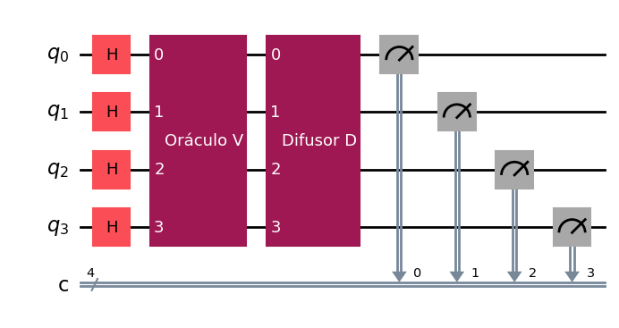
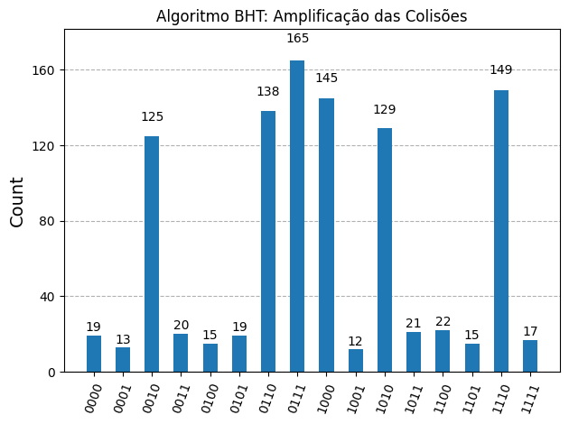

# BHT Algorithm: Quantum Collision Finding

This folder contains the source code and visual results for the implementation of the **Brassard-Høyer-Tapp (BHT) Algorithm** (1997). The algorithm solves the **Collision Problem** for $2$-to-$1$ black-box functions by combining classical memory sampling with **Grover's Quantum Search**, achieving the optimal quantum query complexity of $\mathcal{O}(N^{1/3})$ versus the classical birthday paradox bound of $\mathcal{O}(N^{1/2})$.

[](https://colab.research.google.com/drive/1kZGYeHcZ014jM8A2tuBPwZPFd99C_N-d?usp=sharing)

---

## 1. Theoretical Operation

Given a $2$-to-$1$ function $f: \{0, \dots, N-1\} \to \{0, \dots, N/2-1\}$, the objective is to find a distinct pair $(x_1, x_2)$ such that $f(x_1) = f(x_2)$ and $x_1 \neq x_2$.

### A. Classical Pre-sampling Stage
The algorithm randomly picks $M = \lceil N^{1/3} \rceil$ inputs and stores the pairs $(x, f(x))$ in a classical hash table. If a collision occurs within this sample, the algorithm terminates classically.

### B. Quantum Oracle Construction ($V = F^\dagger U F$)
If no collision is found in the sample, Grover's search is configured across the full space of $N$ states to locate a collision partner. The unitary oracle $V$ is modularly decomposed as:
$$V = F^\dagger U F$$

where:
* $F$: Permutation operator encoding function outputs into quantum states: $F|x\rangle = |f(x)\rangle$.
* $U$: Phase oracle inverting amplitudes of states whose images are in the classical table: $U|y\rangle = -|y\rangle$.
* $F^\dagger$: Uncomputing step returning to the index basis, ensuring $V|x\rangle = -|x\rangle$ for all collision states.

### C. Grover Iterations and Query Complexity
With $M = N^{1/3}$ marked targets in domain $N$, the optimal number of Grover iterations is:
$$R \approx \frac{\pi}{4}\sqrt{\frac{N}{M}} = \frac{\pi}{4}\sqrt{\frac{N}{N^{1/3}}} = \mathcal{O}(N^{1/3})$$

Total queries: Classical ($N^{1/3}$) + Quantum ($N^{1/3}$) = **$\mathcal{O}(N^{1/3})$**, establishing the theoretical lower bound for black-box collision finding.

---

## 2. Implementation and Circuit Visualization

In the [`BHTAlgorithm.py`](./BHTAlgorithm.py) script, the algorithm is implemented for $n = 4$ qubits ($N = 16$ items).

| BHT Quantum Circuit ($H^{\otimes 4} + V + D$) | Amplified Probability Histogram |
| :---: | :---: |
|  |  |

---

## 3. Technical Details

* **Framework:** Qiskit (v1.x)
* **Simulator:** `AerSimulator` (Qiskit Aer) with 1024 shots.
* **Demonstrated Concepts:** Hybrid classical-quantum algorithms, unitary oracle decomposition ($V = F^\dagger U F$), and optimal query complexity.
* **Purpose:** Academic research and demonstration for Quantum Computing Undergraduate Research (UFABC / CMCC).

---

## 4. How to Run

To run the simulation locally:
```bash
python BHT/BHTAlgorithm.py
```
