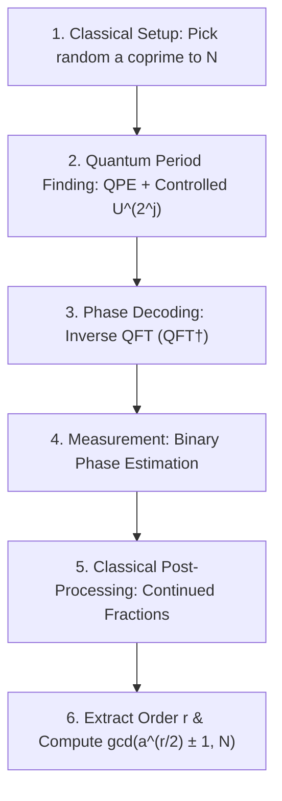
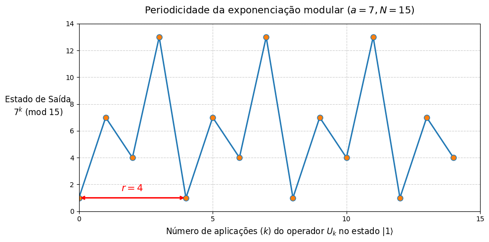

# Shor's Algorithm for Integer Factorization

This folder contains the hybrid quantum-classical implementation of **Shor's Algorithm** for integer factorization. Shor's algorithm provides an exponential speedup over the best known classical factoring algorithms, solving the problem in polynomial time $\mathcal{O}(n^3)$ using Quantum Phase Estimation (QPE).

[](https://colab.research.google.com/drive/1kZGYeHcZ014jM8A2tuBPwZPFd99C_N-d?usp=sharing)

---

## 1. Theoretical Foundations

Factoring a large composite integer $N$ into its prime components is the computational cornerstone of modern asymmetric cryptography (such as RSA-2048). Classically, the most efficient known algorithm is the *General Number Field Sieve* (GNFS), which operates in super-polynomial time:

$$\mathcal{O}\left(\exp\left(c (\log N)^{1/3} (\log \log N)^{2/3}\right)\right)$$

Peter Shor discovered in 1994 that integer factorization can be reduced to **Order Finding** (period finding) of a modular exponentiation function, which a quantum computer solves in polynomial time:

$$\mathcal{O}\left((\log N)^3\right)$$

---

## 2. The Hybrid Quantum-Classical Pipeline

Shor's algorithm is not executed entirely on quantum hardware. Instead, it delegates only the period-finding subroutine to the quantum processor, wrapping it with classical pre- and post-processing:



### A. Classical Reduction to Period Finding
1. Choose a random integer $a$ such that $1 < a < N$.
2. Compute $\gcd(a, N)$ using Euclid's algorithm. If $\gcd(a, N) > 1$, a non-trivial factor is already found.
3. Otherwise, consider the periodic modular function:
   $$f(x) = a^x \pmod{N}$$
   The **order (or period) $r$** is the smallest positive integer such that:
   $$a^r \equiv 1 \pmod{N}$$

### B. Periodic Sequence Illustration ($N = 15, a = 7$)
For $N = 15$ and $a = 7$:
* $7^0 \pmod{15} = 1$
* $7^1 \pmod{15} = 7$
* $7^2 \pmod{15} = 4$
* $7^3 \pmod{15} = 13$
* $7^4 \pmod{15} = 1$ (Period $r = 4$ identified!)

| Modular Function Periodicity ($f(x) = 7^x \pmod{15}$) |
| :---: |
|  |

### C. Factor Extraction Formula
If the extracted period $r$ is **even** and $a^{r/2} \not\equiv -1 \pmod{N}$, then:

$$\left(a^{r/2} - 1\right)\left(a^{r/2} + 1\right) = a^r - 1 = k N$$

Therefore, the non-trivial prime factors of $N$ are obtained efficiently using the greatest common divisor:

$$p = \gcd\left(a^{r/2} - 1, N\right), \quad q = \gcd\left(a^{r/2} + 1, N\right)$$

For $N = 15, a = 7, r = 4$:
* $a^{r/2} = 7^2 = 49$
* $p = \gcd(49 - 1, 15) = \gcd(48, 15) = \mathbf{3}$
* $q = \gcd(49 + 1, 15) = \gcd(50, 15) = \mathbf{5}$

---

## 3. Implementation and Results

The [`ShorAlgorithm.py`](./ShorAlgorithm.py) script implements the hybrid workflow using Qiskit 1.x:

* **Counting Register:** $t = 4$ qubits (resolution $2^4 = 16$).
* **Target Register:** $n_{target} = 4$ qubits initialized to $|1\rangle$.
* **Unitary Permutation Operator:** Encapsulates modular multiplication $U|y\rangle = |(7y) \pmod{15}\rangle$.
* **Inverse QFT Decoder:** Maps phase frequencies to basis states.
* **Continued Fractions:** Decodes fractions such as $0.25 = 1/4 \implies r = 4$.

```bash
=== Shor's Algorithm Factorization Demo ===
Target Composite Number: N = 15
Chosen Coprime Base: a = 7
Greatest Common Divisor gcd(a, N) = 1

Dominant Non-Trivial Measured State: |0100> (decimal 4)
Measured Phase: theta = 4 / 16 = 0.25
Approximated Fraction: 1 / 4
Extracted Order/Period: r = 4

===> Factoring Results:
First Factor:  gcd(7^(4/2) - 1, 15) = gcd(48, 15) = 3
Second Factor: gcd(7^(4/2) + 1, 15) = gcd(50, 15) = 5
SUCCESS: N = 15 factored into non-trivial primes 3 and 5!
```

---

## 4. Requirements and Execution

* **Framework:** Qiskit (v1.x)
* **Simulator:** `AerSimulator` (Qiskit Aer)
* **Classical Algorithms:** Python `math.gcd` & `fractions.Fraction`

To run locally:
```bash
python Shor/ShorAlgorithm.py
```
